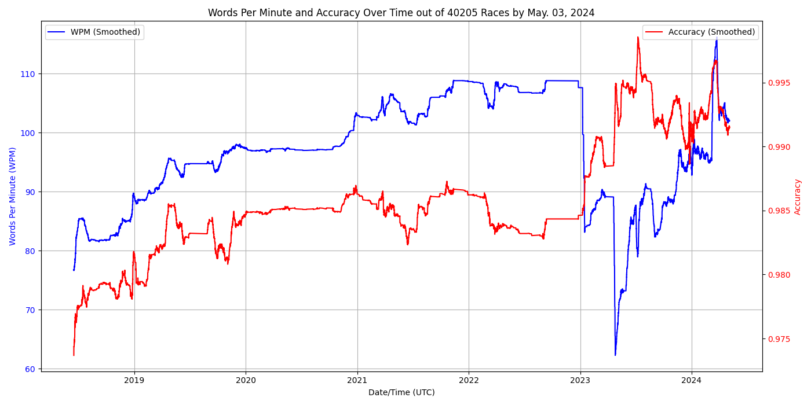

# Typeracer Result Plotter

Typeracer recently updated the "Improvement Over Time" plot in the "My Scores" tab, but I don't think it accurately captures my typing history compared to the older plots I have saved. So, I've decided to create my own version.

The original plot was a line graph displaying changes in words per minute across all my races. In my custom version, I've shifted the focus to track performance over time, rather than just across races. Additionally, I've added a line to represent accuracy, which I believe is equally important.

